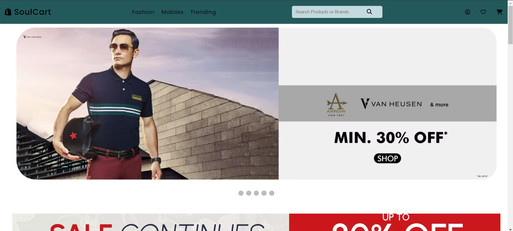

# SoulCart - E-commerce Website

SoulCart is an ecommerce website built using HTML, CSS, and JavaScript. It features various categories such as clothing, mobiles, and appliances.




## Features

- **Homepage:** Overview of the store with featured products.
- **Product Categories:** Separate sections for clothing, mobiles, and appliances.
- **Product Details:** Individual product pages with detailed information.
- **Responsive Design:** Optimized for different screen sizes.

## How to Run

1. Clone the repository:

```bash
git clone https://github.com/your-username/soulcart.git
```
2. Open the project in VS Code or any code editor of your choice.
3. Open index.html in your browser or through a live server extension in your editor.

## Usage
Navigate through different categories using the sidebar. Click on individual products to view their details.


## Contact
If you have any questions or suggestions, please feel free to contact me at [shettyjanav@gmail.com](shettyjanav@gmail.com).
